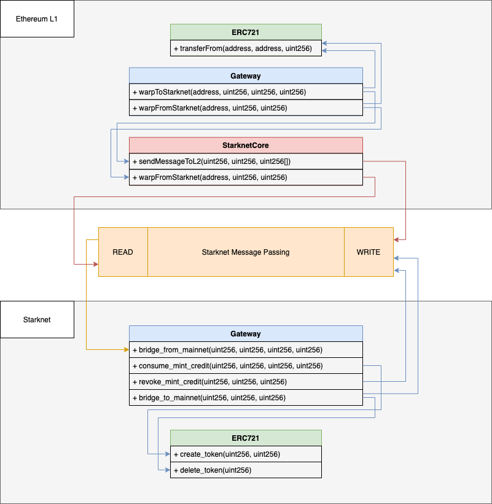

# Qasr:

[Qasr](https://en.wikipedia.org/wiki/Qasr_El_Nil_Bridge) is a simple NFT bridge for Starknet.

Try it out live! 🔥
https://qasr.vercel.app

(special thanks to Argent for their [Argent X plugin](https://github.com/argentlabs/argent-x)!)

## Technical Details

Here's the L1 -> L2 flow:

- On L1 we create a gateway (you will find it in ethereum/contracts/Gateway.sol).
- On L2 we create another gateway (you will find it in starknet/contracts/gateway.cairo).
- On L2 we create a mirror NFT contract of the NFT we wish to bridge (this should be done once, by the creator of the NFT on L1).
- We then take our NFT on L1 and send it to our L1 gateway by calling the "warptoStarknet" method.
- The L1 gateway send a message to the L2 gateway
- The L2 gateway receives the message and handles it in `bridge_from_mainnet`. The gateway creates `mint credits` corresponding to a right to claim an NFT.
- The L2 user can now go and "claim" his NFT to the L2 gateway with `consume_mint_credit`. The gateway will call the L2 smart-contract and mint the appropriate NFT (see function `create_token`).
- If there is an issue with the `consume_mint_credit` call (ex: target contract reverts), L2 users can call `revoke_mint_credit`.

The L2 -> L1 basically works by reverting these steps. Please note that currently, you can only bridge from L2 to L1 an NFT that originated from L1. Meaning native L2 NFT to L1 is NOT supported by Qasr (yet!).

